# Asset Library — Diagrams

Entity, flow, and sequence views of the composable physics asset library.
Namespace is the promoted `physics_through_anim.physics.*` (see
[ARCHITECTURE.md](ARCHITECTURE.md)). Mermaid blocks render inline in VS Code /
GitHub; equivalent **PlantUML** is provided for each where you prefer that toolchain.

---

## 1. Entity / class diagram

The core model: renderable entities, the relations that connect them, the
solver-supplied state, and the composition/orchestration layers.

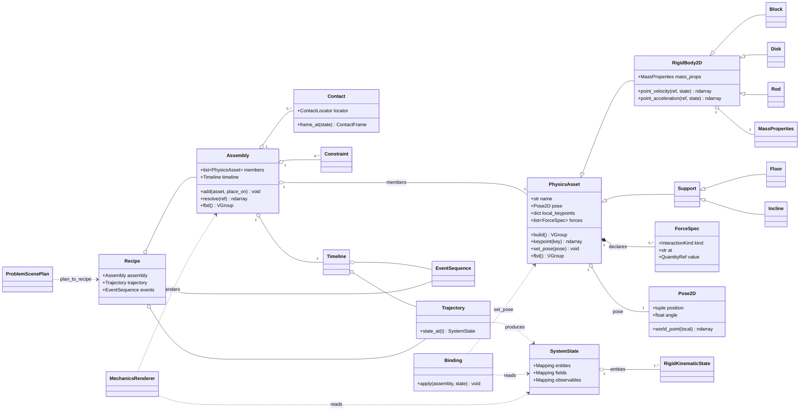

<details><summary>PlantUML equivalent</summary>

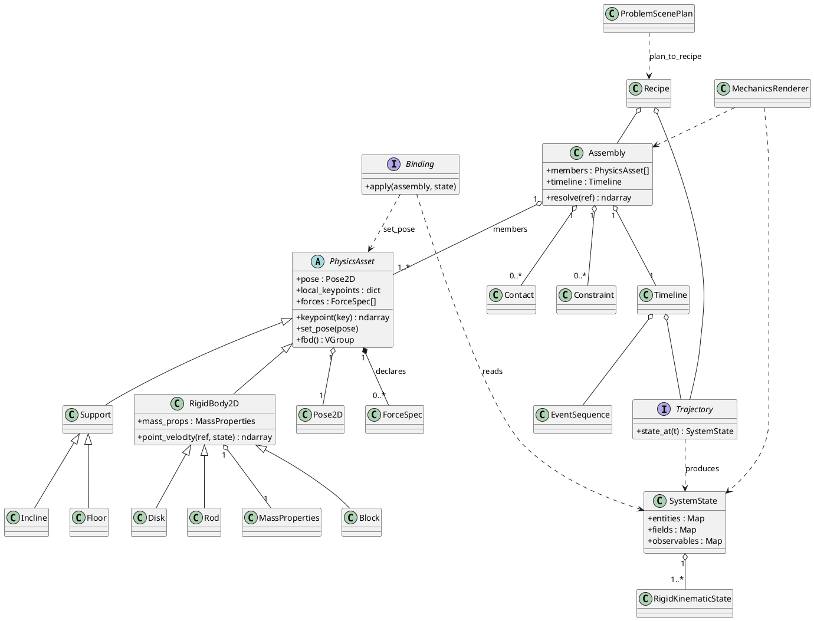

</details>

---

## 1b. Spec-driven scene plan (M17)

The data model authored as JSON/XML: a `ProblemScenePlan` is a bundle of typed
specs that round-trip through the codec, validate, build into an `Assembly`, and
render via a pluggable engine (SVG or manim).

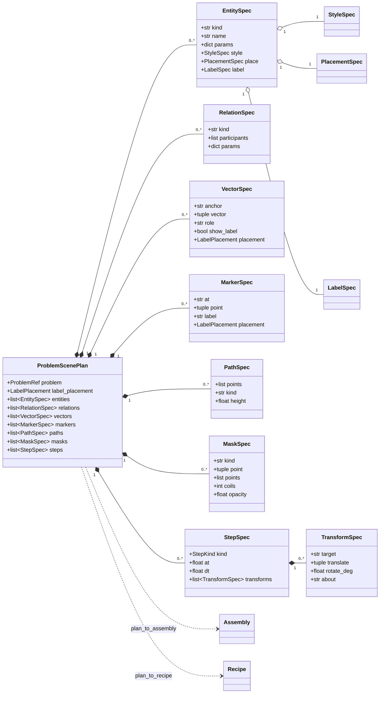

<details><summary>PlantUML equivalent</summary>

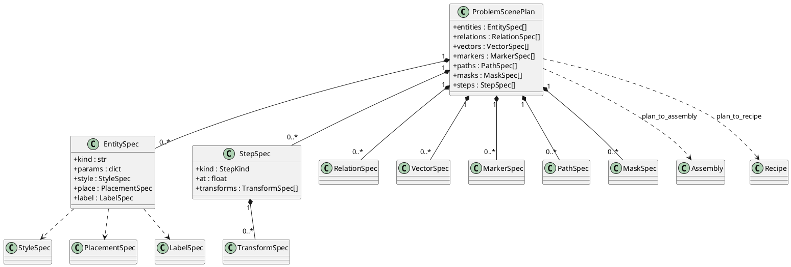

</details>

---

## 2. Flow diagrams

### 2a. Build & render pipeline

The solver-free contract: physics is computed *outside* the framework, fed in as
a plan, turned into generic assets + a trajectory, then rendered.

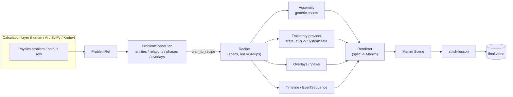

### 2b. Milestone dependency flow (development order)

Green = shipped. Each node is a Jira epic in project **PAC**; edges are the
`is blocked by` links (blocker -> blocked).

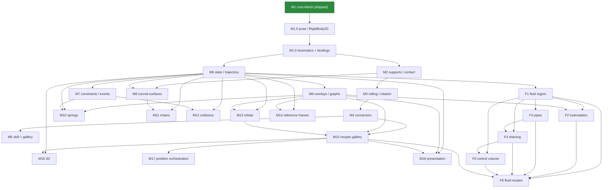

<details><summary>PlantUML activity (pipeline)</summary>

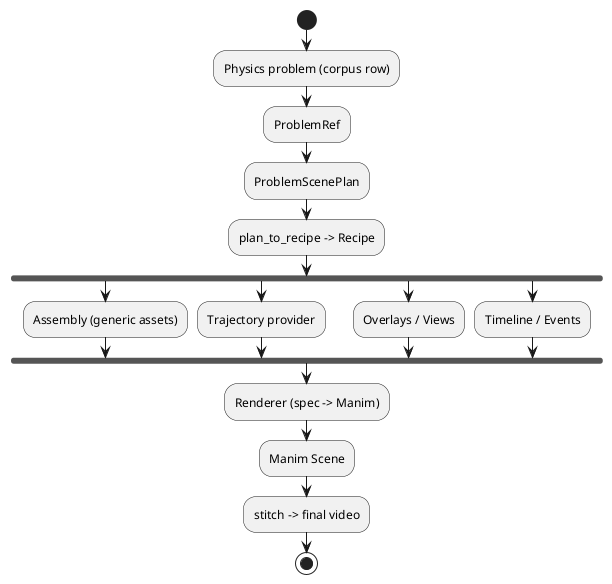

</details>

### 2c. Spec-driven render path (M17)

Authoring a scene as data: a JSON/XML plan is decoded, validated, built into an
`Assembly`, and drawn by a named engine — SVG (dependency-free) or manim (still
PNG, or MP4 when `steps` animate). Both engines draw the cosmetic mask library.

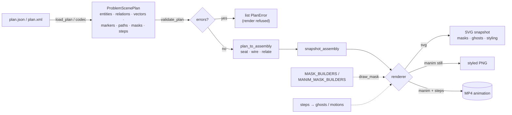

<details><summary>PlantUML activity (spec-driven render path)</summary>

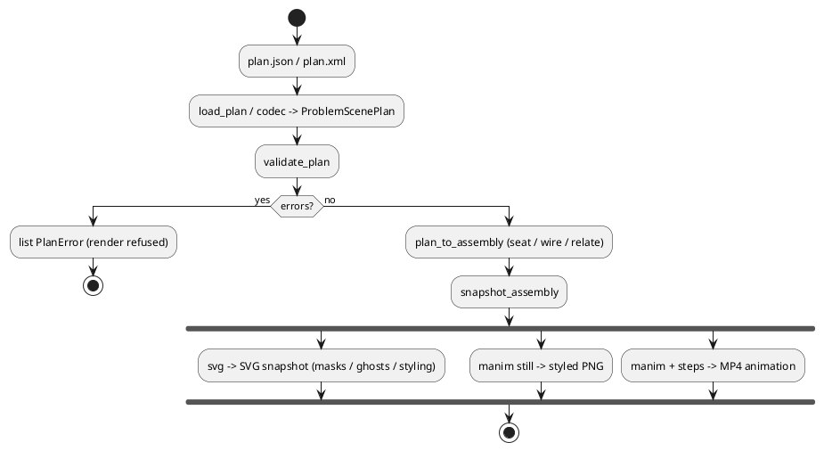

</details>

---

## 3. Sequence diagrams

### 3a. Rendering one animated scene (runtime)

Every rigid body is driven by one binding mechanism reading solver-supplied
state; `set_pose` is absolute so repeated frames never accumulate drift.

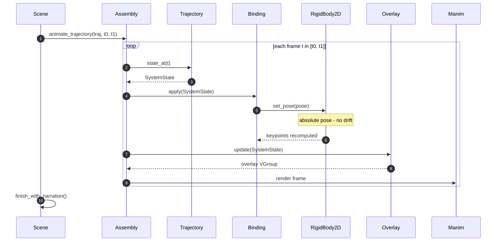

### 3b. TDD development loop (per milestone)

How each milestone is built: acceptance criteria (the story's *Test cases*
subtask) become failing tests first, then the minimal asset makes them pass.

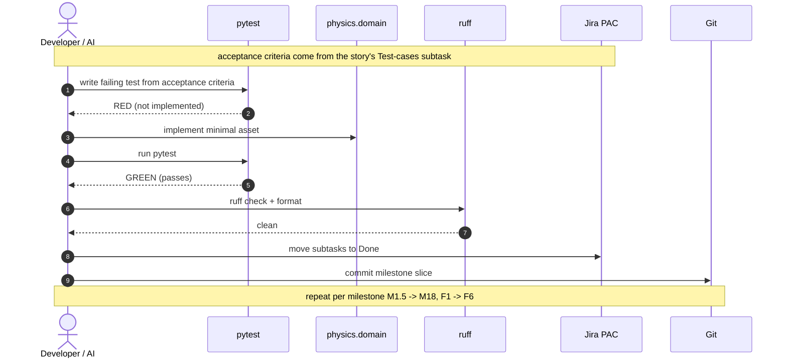

<details><summary>PlantUML sequence (runtime render)</summary>

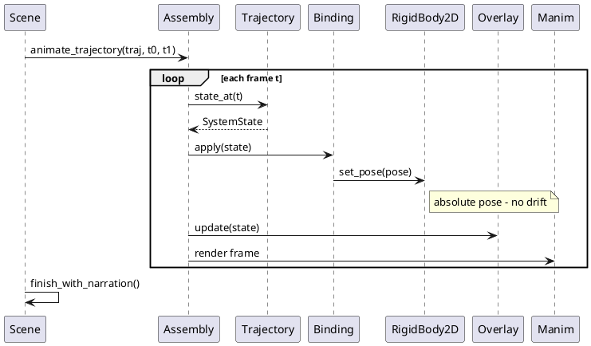

</details>

---

## Rendering these locally

- **Mermaid**: renders inline in VS Code (Markdown preview) and on GitHub.
- **PlantUML**: install a PlantUML extension or run
  `plantuml file.puml`; the fenced ` ```plantuml ` blocks above are ready to copy.
